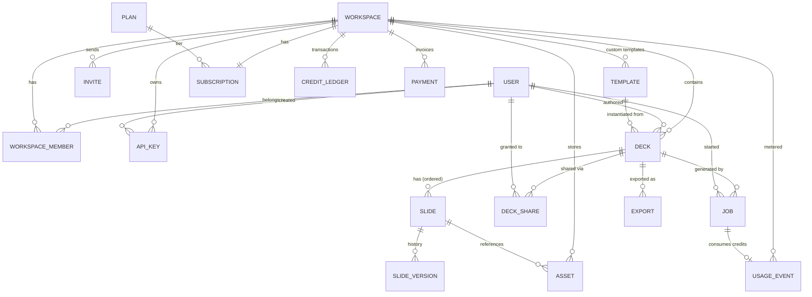

# Data Model — AI Proposal Maker (Gamma-style SaaS)

Status: **draft for review** · Date: 2026-06-27 · DB: **MongoDB (Mongoose)**

This document defines the database design (ER model + collections) for the
full-SaaS build of the product: workspaces/teams, full per-slide editing,
templates, generation jobs, exports, and credit-based billing.

> **Context locked in**
> - **Database:** MongoDB (matches existing `backend/core`).
> - **Scope:** Full SaaS — auth, decks, exports, templates, credits, payments, teams, sharing, API keys.
> - **Editing:** Full per-slide editing (edit / regenerate / reorder / version history).
> - **Auth:** Google OAuth now, extensible to email/password + teams.
>
> Files (PDFs, PPTX, generated/Unsplash images) live in **object storage (S3/R2)**.
> MongoDB stores **URLs + metadata only**, never blobs.

---

## ER diagram

---

## Collections, grouped by domain

### 1. Identity & Access

#### `users` — extend current model

> Keep Google OAuth now; `authProviders[]` lets you add email/password later with no migration.

| Field | Type | Notes |
|---|---|---|
| `_id` | ObjectId | |
| `userName` | string | |
| `email` | string | Unique |
| `avatar` | string | |
| `googleId` | string | |
| `authProviders` | object[] | `{ provider, providerId }` per linked login |
| `defaultWorkspaceId` | → workspaces | Workspace opened on login |
| `createdAt` / `updatedAt` | Date | |

#### `workspaces` — teams / orgs (decks belong here, not to a user)

| Field | Type | Notes |
|---|---|---|
| `_id` | ObjectId | |
| `name` | string | |
| `slug` | string | Unique |
| `ownerId` | → users | |
| `plan` | string | Cached tier name for fast gating |
| `avatar` | string | |
| `createdAt` | Date | |

#### `workspace_members` — join: who's in a workspace + role

> Compound unique index `(workspaceId, userId)`.

| Field | Type | Notes |
|---|---|---|
| `_id` | ObjectId | |
| `workspaceId` | → workspaces | |
| `userId` | → users | |
| `role` | enum | `owner` \| `admin` \| `editor` \| `viewer` |
| `status` | enum | `active` \| `invited` |
| `joinedAt` | Date | |

#### `invites`

| Field | Type | Notes |
|---|---|---|
| `_id` | ObjectId | |
| `workspaceId` | → workspaces | |
| `email` | string | Invitee |
| `role` | enum | Role granted on accept |
| `token` | string | Unique — accept link |
| `invitedBy` | → users | |
| `expiresAt` | Date | |
| `acceptedAt` | Date | Null until accepted |

#### `api_keys` — programmatic access

| Field | Type | Notes |
|---|---|---|
| `_id` | ObjectId | |
| `workspaceId` | → workspaces | |
| `name` | string | Human label |
| `hashedKey` | string | Never store the raw key |
| `prefix` | string | Shown in UI to identify the key |
| `scopes` | string[] | Permitted actions |
| `lastUsedAt` | Date | |
| `createdBy` | → users | |
| `revokedAt` | Date | Null while active |

### 2. Content — decks & slides

#### `decks`

| Field | Type | Notes |
|---|---|---|
| `_id` | ObjectId | |
| `workspaceId` | → workspaces | |
| `authorId` | → users | Creator |
| `title` | string | |
| `deckType` | string | |
| `theme` | string | |
| `accentColor` | object | `{ name, hex }` |
| `canvas` | string | |
| `templateId` | → templates | Preset it was instantiated from |
| `slideOrder` | ObjectId[] | Ordered slideIds — cheap reordering |
| `status` | enum | `draft` \| `generating` \| `ready` \| `archived` |
| `thumbnailUrl` | string | |
| `deletedAt` | Date | Soft-delete |
| `createdAt` / `updatedAt` | Date | |

#### `slides` — separate collection, required for full editing

> `position` as a fractional/float index means drag-reorder updates **one** slide, not the whole deck.

| Field | Type | Notes |
|---|---|---|
| `_id` | ObjectId | |
| `deckId` | → decks | |
| `workspaceId` | → workspaces | |
| `position` | number | Fractional index — source of truth for order |
| `slideNumber` | number | Display number |
| `layout` | string | |
| `title` | string | |
| `content` | object | Layout-specific JSON |
| `html` | string | Rendered, cached; invalidate on edit |
| `imageAssetId` | → assets | |
| `status` | enum | `pending` \| `ready` \| `error` |
| `deletedAt` | Date | Soft-delete |
| `updatedAt` | Date | |

#### `slide_versions` — history / undo

> Keep last N or all; lets you diff/restore per slide.

| Field | Type | Notes |
|---|---|---|
| `_id` | ObjectId | |
| `slideId` | → slides | |
| `deckId` | → decks | |
| `snapshot` | object | `{ content, html, layout }` |
| `editedBy` | → users | Null for AI versions |
| `source` | enum | `ai` \| `user` \| `regenerate` |
| `createdAt` | Date | |

#### `assets` — every image (Unsplash, AI, upload) plus export files

| Field | Type | Notes |
|---|---|---|
| `_id` | ObjectId | |
| `workspaceId` | → workspaces | |
| `type` | enum | `image` \| `pdf` \| `pptx` |
| `url` | string | Object storage (S3/R2) URL |
| `source` | enum | `unsplash` \| `ai` \| `upload` \| `export` |
| `mime` | string | |
| `width` / `height` | number | |
| `bytes` | number | |
| `meta` | object | `{ prompt, unsplashId }` |
| `createdAt` | Date | |

#### `templates` — preset registry (deckType × theme × accent × canvas)

| Field | Type | Notes |
|---|---|---|
| `_id` | ObjectId | |
| `name` | string | |
| `slug` | string | |
| `scope` | enum | `system` \| `workspace` |
| `workspaceId` | → workspaces | Null if system template |
| `deckType` | string | |
| `theme` | string | |
| `accentColor` | object | |
| `canvas` | string | |
| `coverThumbnailUrl` | string | |
| `tier` | enum | `free` \| `premium` |
| `createdAt` | Date | |

#### `deck_shares` — sharing / permissions

| Field | Type | Notes |
|---|---|---|
| `_id` | ObjectId | |
| `deckId` | → decks | |
| `workspaceId` | → workspaces | |
| `sharedWithUserId` | → users | Null for public link share |
| `token` | string | Public-link token |
| `role` | enum | `viewer` \| `editor` |
| `expiresAt` | Date | |
| `createdAt` | Date | |

### 3. Generation & Export

#### `jobs` — one per SSE generation run, survives reconnects

| Field | Type | Notes |
|---|---|---|
| `_id` | ObjectId | |
| `deckId` | → decks | |
| `workspaceId` | → workspaces | |
| `userId` | → users | Who started it |
| `type` | enum | `generate` \| `regenerate_slide` |
| `prompt` | string | |
| `params` | object | `{ noOfSlides, templateId, overrides… }` |
| `status` | enum | `queued` \| `streaming` \| `done` \| `error` |
| `progress` | object | `{ total, completed }` |
| `error` | string | Null unless failed |
| `creditsCharged` | number | |
| `startedAt` / `finishedAt` | Date | |

#### `exports`

| Field | Type | Notes |
|---|---|---|
| `_id` | ObjectId | |
| `deckId` | → decks | |
| `workspaceId` | → workspaces | |
| `format` | enum | `pdf` \| `pptx` \| `gslides` |
| `status` | enum | `pending` \| `ready` \| `error` |
| `assetId` | → assets | The generated file |
| `requestedBy` | → users | |
| `createdAt` | Date | |

### 4. Billing & Monetization

#### `plans` — catalog of tiers

| Field | Type | Notes |
|---|---|---|
| `_id` | ObjectId | |
| `name` | string | e.g. `Free`, `Pro`, `Team` |
| `stripePriceId` | string | Stripe price to checkout against |
| `monthlyCredits` | number | Credits granted each billing cycle |
| `seats` | number | Max workspace members |
| `features` | object | Feature flags — `{ premiumTemplates, pptxExport, … }` |
| `priceCents` | number | Price in minor units |
| `interval` | enum | `month` \| `year` |

#### `subscriptions` — one per workspace

| Field | Type | Notes |
|---|---|---|
| `_id` | ObjectId | |
| `workspaceId` | → workspaces | Unique — one active subscription per workspace |
| `planId` | → plans | Current tier |
| `stripeCustomerId` | string | Stripe customer |
| `stripeSubscriptionId` | string | Stripe subscription |
| `status` | enum | `active` \| `past_due` \| `canceled` \| `trialing` |
| `currentPeriodEnd` | Date | When credits renew / access lapses |
| `cancelAtPeriodEnd` | boolean | Scheduled to cancel at period end |

#### `credit_ledger` — append-only, never mutate

> Balance = sum of all `delta` entries. Refunds are new positive entries, never edits.

| Field | Type | Notes |
|---|---|---|
| `_id` | ObjectId | |
| `workspaceId` | → workspaces | Owner of the balance |
| `delta` | number | Signed (+grant / −spend) |
| `reason` | enum | `grant` \| `generation` \| `export` \| `refund` \| `purchase` |
| `refId` | ObjectId | The `jobId` / `paymentId` that caused this entry |
| `balanceAfter` | number | Running balance snapshot for fast reads / auditing |
| `createdAt` | Date | |

#### `payments` — Stripe invoices / receipts

| Field | Type | Notes |
|---|---|---|
| `_id` | ObjectId | |
| `workspaceId` | → workspaces | Billed workspace |
| `stripeInvoiceId` | string | Stripe invoice |
| `amountCents` | number | Charged amount in minor units |
| `currency` | string | ISO 4217, e.g. `usd` |
| `status` | enum | `paid` \| `open` \| `failed` \| `refunded` |
| `creditsGranted` | number | Credits this payment added to the ledger |
| `createdAt` | Date | |

#### `usage_events` — metering, feeds analytics & ledger

| Field | Type | Notes |
|---|---|---|
| `_id` | ObjectId | |
| `workspaceId` | → workspaces | |
| `userId` | → users | Who triggered the event |
| `event` | enum | `deck_generated` \| `slide_regenerated` \| `export_pdf` \| … |
| `refId` | ObjectId | The deck / slide / export the event refers to |
| `credits` | number | Credits this event consumed |
| `createdAt` | Date | |

---

## Key design decisions

| Decision | Why |
|---|---|
| **Decks/slides belong to `workspace`, not `user`** | Teams require it; a personal account is just a 1-member workspace. |
| **`slides` separate from `decks`** | Per-slide edit/regenerate/version without rewriting the deck. |
| **`position` as fractional index** | Drag-reorder touches one slide doc, not N. |
| **`credit_ledger` append-only** | Billing integrity — balance is derived, every charge is auditable, refunds are just entries. |
| **Files in object storage, URLs in Mongo** | Mongo isn't for blobs; `assets` is the single source of truth for binaries. |
| **`jobs` persisted** | SSE streams can drop; the job doc lets the client reconnect and resume/replay. |
| **Soft-delete (`deletedAt`)** | SaaS expectation — decks/slides/workspaces are recoverable, not hard-deleted. |

---

## Open decisions to resolve before schema implementation

1. **Credit integrity on Mongo** — the append-only ledger works, but concurrent
   generations racing the balance need either MongoDB multi-doc transactions
   (replica set required) or an idempotency-key guard on each charge. Decide now.
2. **`slide.html` caching** — caching rendered HTML on the slide makes
   preview/export instant but edits must invalidate it. Alternative: render on
   demand. Leaning toward caching, given the streaming design.
3. **Version history retention** — keep all `slide_versions` or cap at last N.

---

## Relationship to PLAN.md

`PLAN.md` originally specified Postgres; this document supersedes that choice with
**MongoDB**, matching the existing `backend/core` implementation. The phased build
order in `PLAN.md` still applies — these collections come online across Phases 2–4
(decks/auth → exports → billing).
