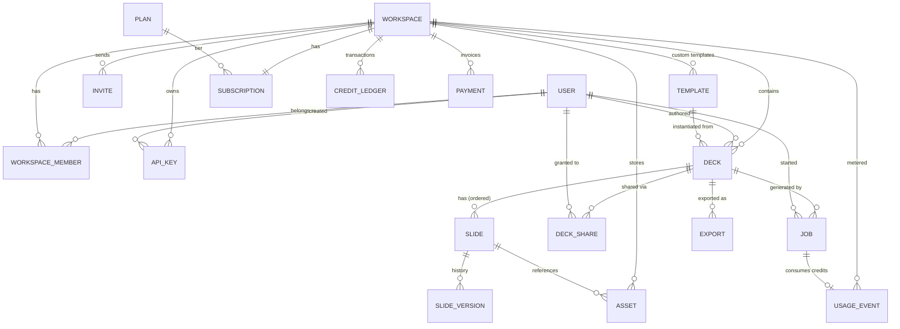

# Data Model — AI Proposal Maker (Gamma-style SaaS)

Status: **draft for review** · Date: 2026-06-27 · DB: **MongoDB (Mongoose)**

This document defines the database design (ER model + collections) for the
full-SaaS build of the product: workspaces/teams, full per-slide editing,
templates, generation jobs, exports, and credit-based billing.

> **Context locked in**
> - **Database:** MongoDB (matches existing `backend/core`).
> - **Scope:** Full SaaS — auth, decks, exports, templates, credits, payments, teams, sharing, API keys.
> - **Editing:** Full per-slide editing (edit / regenerate / reorder / version history).
> - **Auth:** Google OAuth now, extensible to email/password + teams.
>
> Files (PDFs, PPTX, generated/Unsplash images) live in **object storage (S3/R2)**.
> MongoDB stores **URLs + metadata only**, never blobs.

---

## ER diagram

---

## Collections, grouped by domain

### 1. Identity & Access

**`users`** *(extend current model)*
`_id, userName, email (unique), avatar, googleId, authProviders[] {provider, providerId}, defaultWorkspaceId, createdAt, updatedAt`
→ Keep Google OAuth now; `authProviders[]` lets you add email/password later with no migration.

**`workspaces`** *(a.k.a. teams/orgs — decks belong here, not to a user)*
`_id, name, slug (unique), ownerId→users, plan (cached), avatar, createdAt`

**`workspace_members`** *(join: who's in a workspace + role)*
`_id, workspaceId→workspaces, userId→users, role (owner|admin|editor|viewer), status (active|invited), joinedAt`
→ Compound unique index `(workspaceId, userId)`.

**`invites`**
`_id, workspaceId, email, role, token (unique), invitedBy→users, expiresAt, acceptedAt`

**`api_keys`** *(programmatic access)*
`_id, workspaceId, name, hashedKey, prefix, scopes[], lastUsedAt, createdBy, revokedAt`

### 2. Content — decks & slides

**`decks`**
`_id, workspaceId, authorId, title, deckType, theme, accentColor {name,hex}, canvas, templateId→templates, slideOrder[] (array of slideIds for cheap reordering), status (draft|generating|ready|archived), thumbnailUrl, deletedAt, createdAt, updatedAt`

**`slides`** *(separate collection — required for full editing)*
`_id, deckId, workspaceId, position (fractional index), slideNumber, layout, title, content {…layout-specific JSON}, html (rendered, cached), imageAssetId→assets, status (pending|ready|error), deletedAt, updatedAt`
→ `position` as a fractional/float index means drag-reorder updates **one** slide, not the whole deck.

**`slide_versions`** *(history / undo)*
`_id, slideId, deckId, snapshot {content, html, layout}, editedBy, source (ai|user|regenerate), createdAt`
→ Keep last N or all; lets you diff/restore per slide.

**`assets`** *(every image: Unsplash, AI-generated, user upload; plus export files)*
`_id, workspaceId, type (image|pdf|pptx), url (object storage), source (unsplash|ai|upload|export), mime, width, height, bytes, meta {prompt, unsplashId}, createdAt`

**`templates`** *(preset registry: deckType × theme × accent × canvas)*
`_id, name, slug, scope (system|workspace), workspaceId (null if system), deckType, theme, accentColor, canvas, coverThumbnailUrl, tier (free|premium), createdAt`

**`deck_shares`** *(sharing / permissions)*
`_id, deckId, workspaceId, sharedWithUserId→users (null for link share), token (for public link), role (viewer|editor), expiresAt, createdAt`

### 3. Generation & Export

**`jobs`** *(one per SSE generation run — survives reconnects)*
`_id, deckId, workspaceId, userId, type (generate|regenerate_slide), prompt, params {noOfSlides, templateId, overrides…}, status (queued|streaming|done|error), progress {total, completed}, error, creditsCharged, startedAt, finishedAt`

**`exports`**
`_id, deckId, workspaceId, format (pdf|pptx|gslides), status (pending|ready|error), assetId→assets (the file), requestedBy, createdAt`

### 4. Billing & Monetization

**`plans`** *(catalog of tiers)*
`_id, name, stripePriceId, monthlyCredits, seats, features {premiumTemplates, pptxExport…}, priceCents, interval`

**`subscriptions`** *(one per workspace)*
`_id, workspaceId, planId, stripeCustomerId, stripeSubscriptionId, status (active|past_due|canceled|trialing), currentPeriodEnd, cancelAtPeriodEnd`

**`credit_ledger`** *(append-only — balance = sum of entries; never mutate)*
`_id, workspaceId, delta (+/-), reason (grant|generation|export|refund|purchase), refId (jobId/paymentId), balanceAfter, createdAt`

**`payments`** *(Stripe invoices/receipts)*
`_id, workspaceId, stripeInvoiceId, amountCents, currency, status, creditsGranted, createdAt`

**`usage_events`** *(metering — feeds analytics & ledger)*
`_id, workspaceId, userId, event (deck_generated|slide_regenerated|export_pdf…), refId, credits, createdAt`

---

## Key design decisions

| Decision | Why |
|---|---|
| **Decks/slides belong to `workspace`, not `user`** | Teams require it; a personal account is just a 1-member workspace. |
| **`slides` separate from `decks`** | Per-slide edit/regenerate/version without rewriting the deck. |
| **`position` as fractional index** | Drag-reorder touches one slide doc, not N. |
| **`credit_ledger` append-only** | Billing integrity — balance is derived, every charge is auditable, refunds are just entries. |
| **Files in object storage, URLs in Mongo** | Mongo isn't for blobs; `assets` is the single source of truth for binaries. |
| **`jobs` persisted** | SSE streams can drop; the job doc lets the client reconnect and resume/replay. |
| **Soft-delete (`deletedAt`)** | SaaS expectation — decks/slides/workspaces are recoverable, not hard-deleted. |

---

## Open decisions to resolve before schema implementation

1. **Credit integrity on Mongo** — the append-only ledger works, but concurrent
   generations racing the balance need either MongoDB multi-doc transactions
   (replica set required) or an idempotency-key guard on each charge. Decide now.
2. **`slide.html` caching** — caching rendered HTML on the slide makes
   preview/export instant but edits must invalidate it. Alternative: render on
   demand. Leaning toward caching, given the streaming design.
3. **Version history retention** — keep all `slide_versions` or cap at last N.

---

## Relationship to PLAN.md

`PLAN.md` originally specified Postgres; this document supersedes that choice with
**MongoDB**, matching the existing `backend/core` implementation. The phased build
order in `PLAN.md` still applies — these collections come online across Phases 2–4
(decks/auth → exports → billing).
